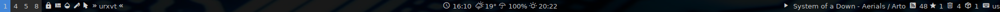
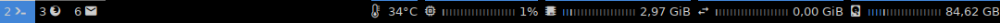
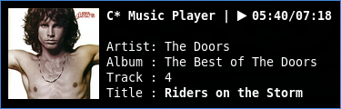

# polybar

general helper scripts for polybar

| name                        | comment                                            |
| :-------------------------- | :------------------------------------------------- |
| polybar_helper_net_check.sh | check a defined time for an internet connection    |
| polybar_helper_output.sh    | format line/foreground color output from xresource |

shell scripts for polybar

| name                 | comment                                          | used helper       |
| :------------------- | :----------------------------------------------- | :---------------- |
| polybar.sh           | start, restart, kill and cycle polybars          |                   |
| polybar_inoreader.sh | shows number of rss/starred feeds from inoreader | output, net_check |
| polybar_music.sh     | cmus statusbar and notification                  | output            |
| polybar_pacman.sh    | shows number of package updates from pacman/aur  | output, net_check |
| polybar_services.sh  | shows status of defined services                 | output            |

config files:

- [dotfiles/polybar](https://github.com/mrdotx/dotfiles/tree/master/.config/polybar)
- [dotfiles/i3](https://github.com/mrdotx/dotfiles/tree/master/.config/i3)
- [dotfiles/cmus](https://github.com/mrdotx/dotfiles/tree/master/.config/cmus)
- [dotfiles/xresource](https://github.com/mrdotx/dotfiles/tree/master/.config/X11)
- [dotfiles/systemd](https://github.com/mrdotx/dotfiles/tree/master/.config/systemd/user)

