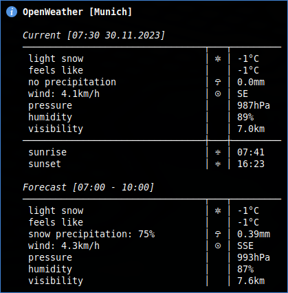

# polybar

shell scripts for polybar

| name                   | comment                                                                 |
| :--------------------- | :---------------------------------------------------------------------- |
| polybar.sh             | start, restart, kill and cycle polybars                                 |
| polybar_freshrss.sh    | shows the number of rss feeds (unreaded/starred) from freshrss          |
| polybar_helper.sh      | used in the other scripts for output and net check                      |
| polybar_inoreader.sh   | shows the number of rss feeds (unreaded/starred) from inoreader         |
| polybar_music.sh       | cmus statusbar and notification                                         |
| polybar_openweather.sh | shows current/forecast weather and sunrise/sunset time from openweather |
| polybar_pacman.sh      | shows the number of package updates from pacman/aur                     |
| polybar_services.sh    | shows the status of defined services                                    |
| polybar_trash-cli.sh   | shows the number of trash items                                         |

config files:

- [dotfiles/polybar](https://github.com/mrdotx/dotfiles/tree/master/.config/polybar)
- [dotfiles/i3](https://github.com/mrdotx/dotfiles/tree/master/.config/i3)
- [dotfiles/cmus](https://github.com/mrdotx/dotfiles/tree/master/.config/cmus)
- [dotfiles/xresource](https://github.com/mrdotx/dotfiles/tree/master/.config/X11)
- [dotfiles/systemd](https://github.com/mrdotx/dotfiles/tree/master/.config/systemd/user)

