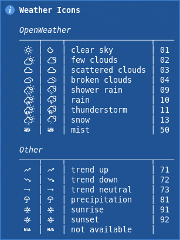

# polybar

general helper scripts for polybar

| name                 | comment                                            |
| :------------------- | :------------------------------------------------- |
| polybar_net_check.sh | check a defined time for an internet connection    |
| polybar_output.sh    | format line/foreground color output from xresource |

shell scripts for polybar

| name                      | comment                                                                    | used helper       |
| :------------------------ | :------------------------------------------------------------------------- | :---------------- |
| polybar.sh                | start, restart, kill and cycle polybars                                    |                   |
| polybar_freshrss.sh       | shows the number of rss feeds (unreaded/starred) from freshrss             | output, net_check |
| polybar_inoreader.sh      | shows the number of rss feeds (unreaded/starred) from inoreader            | output, net_check |
| polybar_music.sh          | cmus statusbar and notification                                            | output            |
| polybar_openweathermap.sh | shows current/forecast weather and sunrise/sunset time from openweathermap | output, net_check |
| polybar_pacman.sh         | shows the number of package updates from pacman/aur                        | output, net_check |
| polybar_services.sh       | shows the status of defined services                                       | output            |
| polybar_trash.sh          | shows the number of trash items                                            | output            |

config files:

- [dotfiles/polybar](https://github.com/mrdotx/dotfiles/tree/master/.config/polybar)
- [dotfiles/i3](https://github.com/mrdotx/dotfiles/tree/master/.config/i3)
- [dotfiles/cmus](https://github.com/mrdotx/dotfiles/tree/master/.config/cmus)
- [dotfiles/xresource](https://github.com/mrdotx/dotfiles/tree/master/.config/X11)
- [dotfiles/systemd](https://github.com/mrdotx/dotfiles/tree/master/.config/systemd/user)

